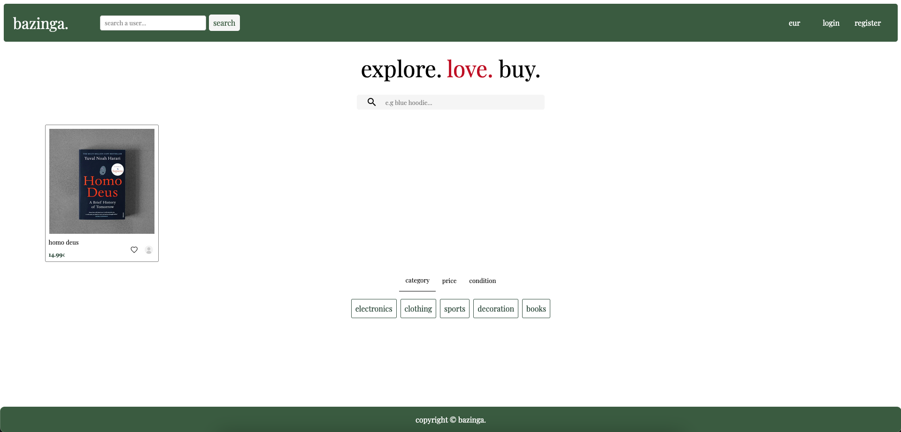
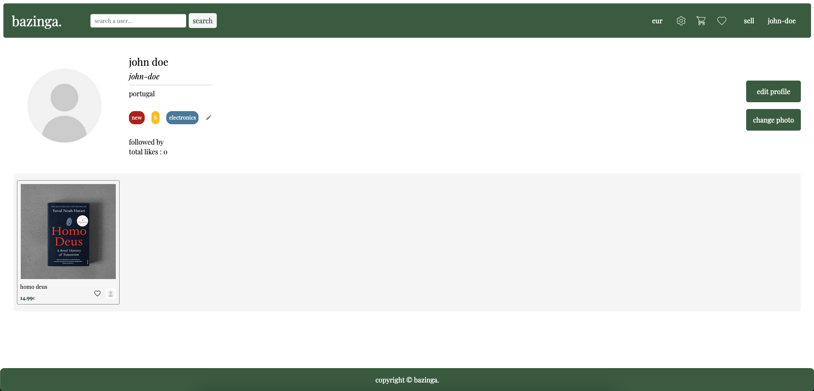
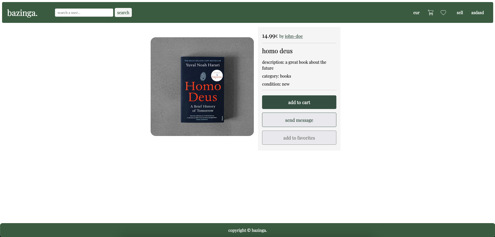

# bazinga.

## Group ltw06g02

- Diogo Martins (up202207944) 40%
- Afonso Moura () 30%
- Rodrigo Miranda () 30%

## Install Instructions

    git clone git@github.com:FEUP-LTW-2024/ltw-project-2024-ltw06g02.git
    cd ltw-project-2024-ltw06g02
    git checkout final-delivery-v1
    sqlite3 database/website.db < database/website.sql
    php -S localhost:9000

## Admin Account

- username: john-doe
- password: admin-123

## Screenshots

   
   
   

## Implemented Features

**General**:

- [X] Register a new account.
- [X] Log in and out.
- [X] Edit their profile, including their name, username, password, and email.

**Sellers**  should be able to:

- [X] List new items, providing details such as category, brand, model, size, and condition, along with images.
- [X] Track and manage their listed items.
- [X] Respond to inquiries from buyers regarding their items and add further information if needed.
- [ ] Print shipping forms for items that have been sold.

**Buyers**  should be able to:

- [X] Browse items using filters like category, price, and condition.
- [X] Engage with sellers to ask questions or negotiate prices.
- [X] Add items to a wishlist or shopping cart.
- [X] Proceed to checkout with their shopping cart (simulate payment process).

**Admins**  should be able to:

- [X] Elevate a user to admin status.
- [X] Introduce new item categories, sizes, conditions, and other pertinent entities.
- [X] Oversee and ensure the smooth operation of the entire system.

**Security**:
We have been careful with the following security aspects:

- [X] **SQL injection**
- [X] **Cross-Site Scripting (XSS)**
- [X] **Cross-Site Request Forgery (CSRF)**

**Password Storage Mechanism**: hash_password&verify_password

**Aditional Requirements**:

We also implemented the following additional requirements:

- [ ] **Rating and Review System**
- [X] **Promotional Features**
- [X] **Analytics Dashboard**
- [X] **Multi-Currency Support**
- [ ] **Item Swapping**
- [ ] **API Integration**
- [ ] **Dynamic Promotions**
- [X] **User Preferences**
- [X] **Shipping Costs**
- [X] **Real-Time Messaging System**
- [X] **Followers System**
- [X] **Profile Search**
- [X] **Purchases/Sales Historic**